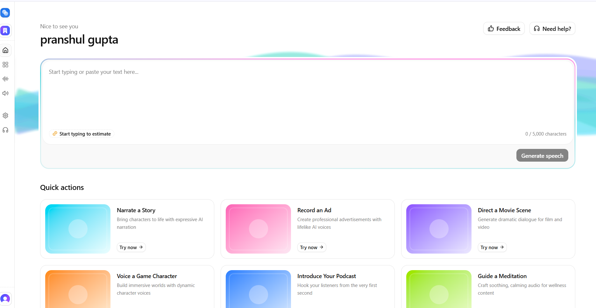
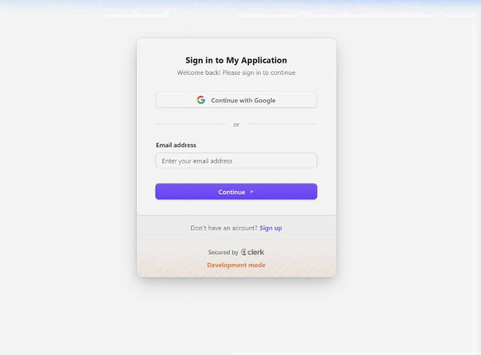
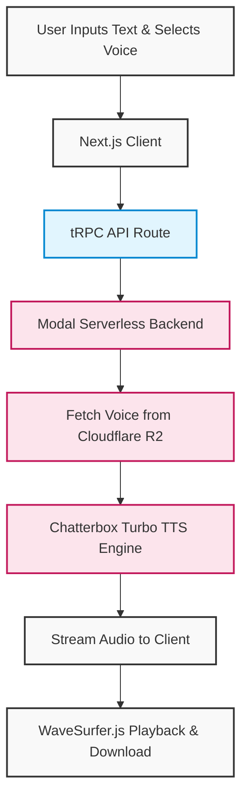
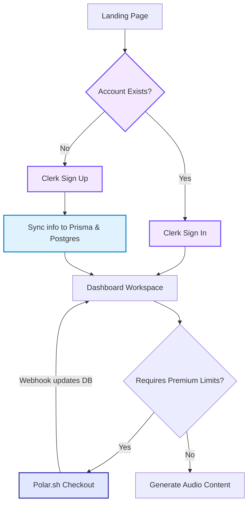

<div align="center">
  

  # Resonance AI
  
  **Bring your stories to life with advanced AI voices.**

  [](https://nextjs.org/)
  [](https://www.typescriptlang.org/)
  [](https://tailwindcss.com/)
  [](https://prisma.io/)
  [](https://clerk.com/)
</div>

---

##  Overview

**Resonance AI** is a state-of-the-art platform that empowers creators to generate expressive, lifelike AI narration. Whether you are building an immersive game world, crafting a soothing meditation guide, or directing a cinematic ad, Resonance provides the perfect voices for every scenario.

---

##  Features & UI

Our gorgeous, interactive user interface makes generating text-to-speech a breeze.

###  The Dashboard
The core workspace. Start typing or paste your text, and explore quick actions to kickstart your creative process:
-  **Narrate a Story:** Bring characters to life with expressive AI narration.
-  **Record an Ad:** Create professional advertisements with lifelike AI voices.
-  **Direct a Movie Scene:** Generate dramatic dialogue for film and video.
-  **Voice a Game Character:** Build immersive worlds with dynamic character voices.
-  **Introduce Your Podcast:** Hook your listeners from the very first second.
-  **Guide a Meditation:** Craft soothing, calming audio for wellness content.

<div align="center">
  
  <p><em>The Resonance AI Dashboard interface</em></p>
</div>

###  Seamless Onboarding
A frictionless, secure, and beautiful sign-up experience powered by Clerk.

<div align="center">
  
  <p><em>Sleek Sign Up Page & Authentication</em></p>
</div>

---

## � Application Workflows

Here is the architectural overview and workflow of Resonance AI:

### 1. Text-to-Speech Generation
This workflow illustrates how user text is processed into high-quality audio narration involving the Next.js frontend, tRPC backend, and Modal serverless functions.



### 2. User Authentication & Subscription
The user onboarding pipeline integrated with Clerk authentication and Polar.sh secure payment processing.



---

## �🛠️ Tech Stack

- **Frontend:** Next.js 14/15, React 19, Tailwind CSS, shadcn/ui
- **Backend:** tRPC, Prisma ORM, PostgreSQL
- **Authentication:** Clerk
- **Storage:** AWS S3
- **Audio Processing:** WaveSurfer.js, RecordRTC
- **Payments & Subscriptions:** Polar.sh

---

##  Getting Started

Follow these steps to set up Resonance AI locally:

### 1. Clone the repository
```bash
git clone https://github.com/pranshulgupta33940/resonance-ai.git
cd resonance-main
```

### 2. Install dependencies
```bash
npm install
```

### 3. Environment Variables
Create a `.env` file in the root directory and add the required environment variables:
- Database URL (Postgres/SQLite)
- Clerk API Keys
- AWS S3 Credentials
- Polar Token

### 4. Database Setup
Push the Prisma schema to your database and generate the client:
```bash
npx prisma db push
npx prisma generate
```

### 5. Run the Development Server
```bash
npm run dev
```

Open [http://localhost:3000](http://localhost:3000) with your browser to see the result.

---

##  Contributing

Contributions are what make the open source community such an amazing place to learn, inspire, and create. Any contributions you make are **greatly appreciated**.

1. Fork the Project
2. Create your Feature Branch (`git checkout -b feature/AmazingFeature`)
3. Commit your Changes (`git commit -m 'Add some AmazingFeature'`)
4. Push to the Branch (`git push origin feature/AmazingFeature`)
5. Open a Pull Request

-->
